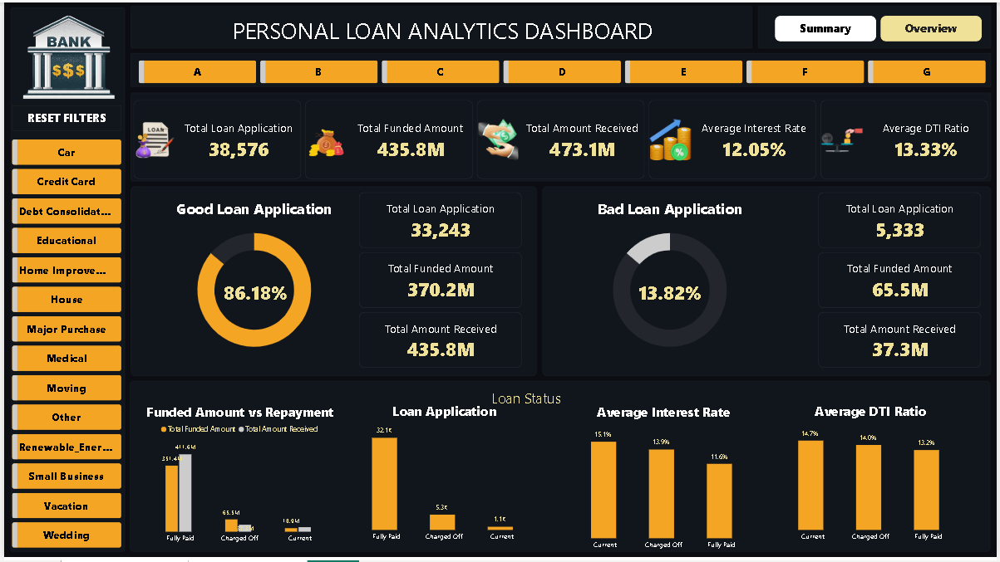
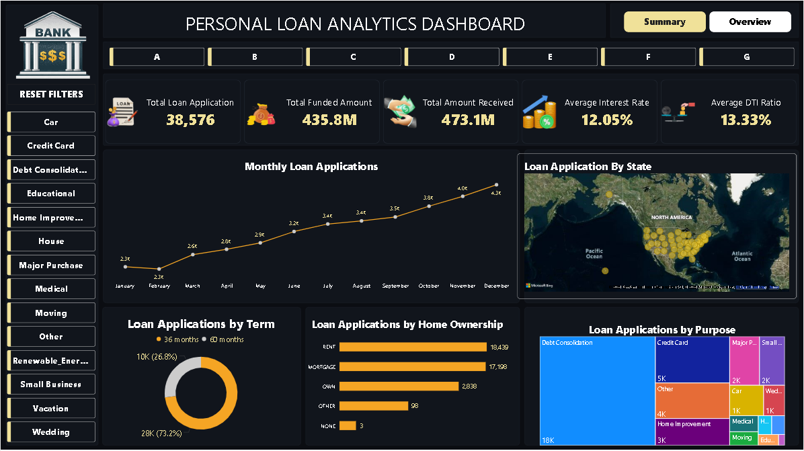

# Personal Loan Analytics Dashboard
## Project Overview

This project analyzes a Personal Loan Portfolio using SQL, Excel,Power BI and Tableau. The dashboard provides insights into loan applications, funded amounts, repayments, loan status, customer profiles, interest rates, and debt-to-income ratios to support data-driven lending decisions.

## Tools & Technologies
SQL
Power BI
Microsoft Excel
Power Query
DAX
Tableau
## Business Objective

The objective of this project is to monitor loan portfolio performance, identify lending trends, evaluate repayment behavior, and assess credit risk using interactive dashboards.

## Key KPIs
Total Loan Applications
Total Funded Amount
Total Amount Received
Average Interest Rate
Average DTI Ratio
Good Loan Percentage
Bad Loan Percentage
Loan Status Analysis
Dashboard Features
Summary Dashboard
Good Loan vs Bad Loan Analysis
Funded Amount vs Amount Received
Loan Status Performance
Interest Rate Analysis
DTI Ratio Analysis
Overview Dashboard
Monthly Loan Applications Trend
State-wise Loan Distribution
Loan Applications by Purpose
Loan Applications by Term
Home Ownership Analysis
## SQL Analysis

The project uses SQL queries for:

Data Cleaning
KPI Calculations
Loan Performance Analysis
Portfolio Segmentation
Risk Assessment

Example KPI Query:

SELECT
COUNT(id) AS Total_Loan_Applications,
SUM(loan_amount) AS Total_Funded_Amount,
SUM(total_payment) AS Total_Amount_Received
FROM financial_loan;
Insights
Total Loan Applications: 38,576
Total Funded Amount: $435.8M
Total Amount Received: $473.1M
Good Loans: 86.18%
Bad Loans: 13.82%
Debt Consolidation is the most common loan purpose.
Project Structure
Dataset/
SQL/
PowerBI/
Excel/
Documentation/
Author

Akshay Sargar

Data Analyst | SQL | Tableau | Power BI | Excel

5. Upload Screenshots

Place the dashboard screenshots here:

PowerBI/
└── Dashboard_Screenshots/
    ├── Summary.png
    └── Overview.png

In README, display screenshots:
# Dashboard Screenshots

## Summary Dashboard

## Overview Dashboard

6. Git Commands

Create repository locally:

git init

Add files:

git add .

First commit:

git commit -m "Added Personal Loan Analytics Dashboard project"

Connect GitHub repository:

git remote add origin https://github.com/yourusername/personal-loan-analytics-dashboard.git

Push project:

git branch -M main

git push -u origin main
7. Professional Commit Messages

Initial upload:

Added Personal Loan Analytics Dashboard project

SQL update:

Added loan portfolio KPI analysis queries

Power BI update:

Enhanced dashboard visuals and DAX measures

Documentation update:

Updated project documentation and screenshots

Final version:

Completed end-to-end Personal Loan Analytics project
